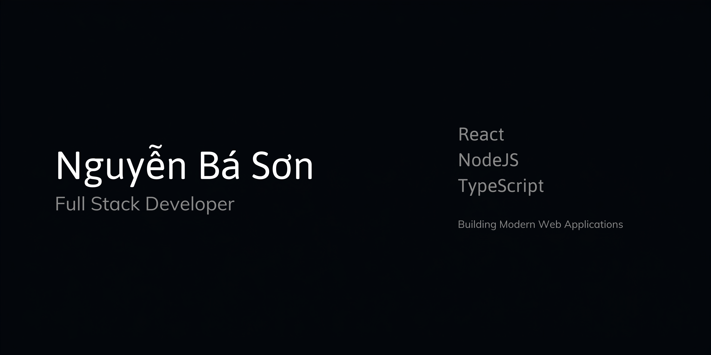

<!-- BANNER -->
<div align="center">
  
</div>

<br />

<!-- TYPING SVG -->
<div align="center">
  <a href="https://github.com/bason812004">
    
  </a>
</div>

<br />

<!-- SOCIAL LINKS -->
<div align="center">
  <a href="https://bason-portfolio.vercel.app/" target="_blank">
    
  </a>
  <a href="mailto:bason812004@gmail.com">
    
  </a>
  <a href="https://github.com/bason812004">
    
  </a>
  <a href="#">
    
  </a>
  <a href="#">
    
  </a>
</div>

<br />

<!-- PROFILE VIEWS -->
<div align="center">
  
</div>

---

<!-- ABOUT ME -->
## 👨‍💻 About Me

Hello! I am **Nguyễn Bá Sơn**, a Software Engineering Student at **Industrial University of Ho Chi Minh City (IUH)**, Vietnam, and a passionate **Full Stack Developer**.

I specialize in constructing end-to-end web applications with robust backend micro-architectures and responsive, modern frontends. My engineering methodology emphasizes clean code, optimal database performance, secure RESTful APIs, and scalable system architecture.

```typescript
const developer = {
  name: "Nguyễn Bá Sơn",
  role: "Full Stack Developer",
  institution: "Industrial University of Ho Chi Minh City (IUH)",
  location: "Vietnam",
  email: "bason812004@gmail.com",
  portfolio: "https://bason-portfolio.vercel.app/",
  coreFocus: ["Scalable Web Apps", "REST APIs", "Database Optimization", "Clean Code Architecture"],
  status: "Open to Full Stack & Backend Developer Roles"
};
```

---

<!-- TECH STACK -->
## 🛠️ Tech Stack

### Frontend
<p align="left">
  <a href="https://skillicons.dev">
    
  </a>
</p>

### Backend
<p align="left">
  <a href="https://skillicons.dev">
    
  </a>
  
  
</p>

### Database
<p align="left">
  <a href="https://skillicons.dev">
    
  </a>
</p>

### Tools & DevOps
<p align="left">
  <a href="https://skillicons.dev">
    
  </a>
</p>

---

<!-- FEATURED PROJECTS -->
## 🚀 Featured Projects

### 1. 🏟️ Smart Sports Booking Platform
> **Repository:** [https://github.com/bason812004/SportBooking](https://github.com/bason812004/SportBooking)

An intelligent, full-stack sports venue booking system built with modern scalable architecture, real-time availability tracking, and automated tournament workflows.

- **Dynamic Pricing Engine:** Algorithmic price adjustment based on peak hours and demand.
- **AI Demand Prediction:** Intelligent analytics forecasting slot occupancy.
- **Voucher & Discount Engine:** Custom promotional code matrix with usage limits.
- **Tournament Platform:** Interactive brackets, scheduling, and live score management.
- **Analytics & Partner Dashboards:** Comprehensive revenue metrics for facility owners.
- **Security:** Secure JWT authentication & RBAC access control.

`React` • `TypeScript` • `Node.js` • `Express.js` • `Prisma ORM` • `PostgreSQL` • `Supabase`

---

### 2. 🏨 Hotel Booking System
A high-performance reservation platform empowering users to search, review, and book hotel accommodations seamlessly.

- **Advanced Hotel Search:** Multi-criteria filtering by pricing, location, and amenities.
- **Real-Time Booking:** Instant reservation confirmation with status lifecycle management.
- **User Authentication:** Encrypted session handling & user profile management.
- **Responsive UI:** Adaptive interface tailored for mobile and desktop screens.

`React` • `JavaScript` • `Node.js` • `Express.js` • `PostgreSQL` • `Tailwind CSS`

---

### 3. 🍽️ Restaurant Booking System
An enterprise dining table reservation platform designed to streamline restaurant operations and revenue monitoring.

- **Table Reservation:** Real-time table selection and automated slot allocation.
- **Revenue Dashboard:** Analytics visualizer monitoring daily sales and guest metrics.
- **Customer Management:** Centralized database for guest history and preferences.

`React` • `TypeScript` • `Node.js` • `Express.js` • `MySQL` • `HTML5/CSS3`

---

### 4. 💬 Chat Application
A real-time messaging application delivering instant peer-to-peer and group communication with seamless synchronization.

- **Realtime Chat:** Low-latency socket connections for instantaneous message delivery.
- **Group Channels:** Creation and moderation of multi-user group chat rooms.
- **Secure Authentication:** User verification and encrypted channel storage.

`React` • `Node.js` • `Express.js` • `Firebase` • `REST API`

---

<!-- GITHUB STATS -->
## 📊 GitHub Stats

<div align="center">
  
</div>

<br />

<!-- TOP LANGUAGES -->
## 💻 Top Languages

<div align="center">
  
</div>

<br />

<!-- GITHUB STREAK -->
## 🔥 GitHub Streak

<div align="center">
  
</div>

<br />

<!-- ACTIVITY GRAPH -->
## 📈 Activity Graph

<div align="center">
  
</div>

<br />

<!-- PROFILE SUMMARY CARDS -->
## 📋 Profile Summary Cards

<div align="center">
  
</div>

<br />

<!-- GITHUB TROPHY -->
## 🏆 GitHub Trophy

<div align="center">
  
</div>

<br />

<!-- WAKATIME -->
## ⏱️ WakaTime Stats

<div align="center">
  
</div>

<br />

<!-- CONTRIBUTION SNAKE -->
## 🐍 Contribution Snake

<div align="center">
  <picture>
    <source media="(prefers-color-scheme: dark)" srcset="https://raw.githubusercontent.com/bason812004/bason812004/output/github-contribution-grid-snake-dark.svg">
    <source media="(prefers-color-scheme: light)" srcset="https://raw.githubusercontent.com/bason812004/bason812004/output/github-contribution-grid-snake.svg">
    
  </picture>
</div>

---

<!-- CURRENTLY LEARNING -->
## 📚 Currently Learning

- 🐳 **Docker & Containerization:** Building microservice container images and docker-compose configurations.
- ⚡ **Redis Caching:** Memory store caching patterns, pub/sub channels, and session management.
- 🏗️ **System Design:** High-availability architecture, load balancing, sharding, and message queues.
- 🔄 **CI/CD Pipelines:** Automated build, test, and release deployment via GitHub Actions.
- ☸️ **Kubernetes:** Orchestrating multi-container production deployments.
- ☁️ **Amazon Web Services (AWS):** EC2, S3, RDS, and serverless deployment models.
- ⚛️ **Next.js:** Full-stack React SSR/SSG rendering and App Router paradigms.
- 🤖 **AI Integration:** LLM API integration, retrieval-augmented generation (RAG), and vector stores.

---

<!-- CAREER GOALS -->
## 🎯 Career Goals

> Become a professional **Full Stack Software Engineer** specializing in scalable backend systems and modern web applications.

---

<!-- CONTACT -->
## 📬 Contact & Connect

<div align="center">
  <p>Feel free to reach out for collaborations, engineering opportunities, or technical discussions!</p>

  <a href="https://bason-portfolio.vercel.app/" target="_blank">
    
  </a>
  <a href="mailto:bason812004@gmail.com">
    
  </a>
  <a href="https://github.com/bason812004">
    
  </a>
</div>

<br />

<div align="center">
  <sub>Designed & Developed with precision by <b>Nguyễn Bá Sơn</b></sub>
</div>
